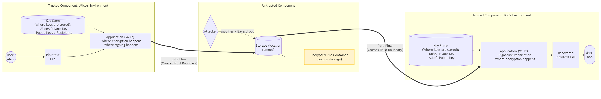

# D1 - Architecture & Threat Model

## 1. System Overview

**Problem to Solve**
The Secure Digital Document Vault (Secure File Exchange Platform) solves the problem of securely transferring files between users over untrusted communication channels or storage mediums. It guarantees that an attacker observing, intercepting, or modifying the data at rest or in transit cannot access the plaintext contents, alter the file undetected, or impersonate the sender.

**Core Features**
* **End-to-End Protection:** Local authenticated encryption (AEAD) of file contents and sensitive metadata before leaving the sender's environment.
* **Controlled Sharing:** Hybrid encryption scheme to securely exchange the symmetric Data Encryption Key (DEK) only with authorized recipients.
* **Authenticity and Non-Repudiation:** Digital signatures applied to the secure package to mathematically prove the sender's identity.
* **Tamper Detection:** Cryptographic verification engine that strictly validates metadata, signatures, and payload integrity before any decryption occurs.
* **CLI Interface:** Command-line driven application logic executed entirely within the user's local host.

**Explicitly Out of Scope**
To focus strictly on applied cryptography, the following elements are out of scope:
* Graphical User Interfaces (GUI) and web applications.
* Cloud infrastructure, centralized authentication servers, and real network protocols.
* Dynamic key distribution centers (Public keys are assumed to be established via local keystores or manual out-of-band exchange).

## 2. Architecture Diagram

**Architectural Details:**
* **Where encryption happens:** Symmetrically within Alice's Secure File Exchange Engine (Trusted Sender boundary) before the file is exposed to the network.
* **Where signing happens:** Following encryption, the package is signed inside Alice's Secure File Exchange Engine using her private key.
* **Where keys are stored:** Exclusively in the local Keystores of the respective trusted client environments. Private keys never cross trust boundaries.

## 3. Security Requirements

* **Confidentiality of file contents:** An attacker who obtains the encrypted container from the untrusted storage must not be able to learn the file contents without the correct private key.
* **Integrity of file contents:** Any unauthorized modification to the encrypted file container must be strictly detectable by the recipient application before decryption occurs.
* **Authenticity of file sender:** The system must guarantee that the recipient can mathematically verify that the secure package originated from the expected sender, and an attacker cannot forge a package claiming to be from them.
* **Confidentiality of private keys:** Private keys must never leave the user local keystore in plaintext, ensuring an attacker with access to the transfer channel cannot extract or compromise them.
* **Protection against tampering:** The system must verify the integrity of all sensitive metadata and the payload together; if an attacker alters recipient IDs or timestamps, the application must safely reject the package.

## 4. Threat Model

**Assets to protect:**
* **File contents:** The original information exchanged between users.
* **File metadata:** Sensitive details such as file names, sizes, and recipient identities.
* **Private keys:** The symmetric Data Encryption Key and the asymmetric private keys.
* **Passwords:** User credentials required to unlock local keystores.
* **Signature validity:** The cryptographic proof linking the file to the sender identity.

**Adversaries:**
* External attacker with read and write access to the untrusted stored containers or shared folder.
* Network eavesdropper monitoring the communication channel to capture packages.
* Active attacker attempting to modify metadata, replay packages, or alter the payload in transit.

**What attackers can do:**
* Intercept, copy, and read any encrypted data or exposed metadata traversing the untrusted environment.
* Modify the secure package, flip bits in the ciphertext, or alter unencrypted metadata directly on the storage medium.
* Delete legitimate packages to cause a denial of service.
* Attempt to replay an older, valid package to trick the recipient.

**What attackers cannot do:**
* Access the local trusted environments or devices of the sender and recipient.
* Extract plaintext private keys from the secure local keystores.
* Bypass cryptographic mathematics, such as guessing a 256-bit key or forging a digital signature without possessing the private key.

## 5. Trust Assumptions

* Users protect their passwords and do not expose them to third parties.
* Public keys are authentic and correctly associated with their respective owners through a prior secure exchange.
* The operating system provides secure randomness for key generation and cryptographic nonces.
* The storage location and transfer channels are completely untrusted and accessible to attackers.
* The local client environments of both the sender and the recipient are secure and free of malware that could steal data before encryption or after decryption.

## 6. Attack Surface Review

* **File input:**
  * *What could go wrong:* An attacker could provide a maliciously crafted file, an excessively large file, or manipulate the file path.
  * *Security property at risk:* Availability and Integrity.
* **Metadata parsing:**
  * *What could go wrong:* An attacker modifies recipient IDs, file names, or timestamps in the package to trick the application during parsing.
  * *Security property at risk:* Confidentiality and Integrity.
* **Key import/export:**
  * *What could go wrong:* A user accidentally imports a compromised public key, or the system loads a substituted key provided by an attacker.
  * *Security property at risk:* Authenticity and Confidentiality.
* **Password entry:**
  * *What could go wrong:* Weak passwords could be brute-forced, or the CLI might expose the password in the terminal history.
  * *Security property at risk:* Confidentiality of private keys.
* **Sharing workflow:**
  * *What could go wrong:* The sender accidentally selects the wrong recipient public key, encrypting the file for an unauthorized user.
  * *Security property at risk:* Confidentiality of file contents.
* **Signature verification:**
  * *What could go wrong:* The verification engine accepts a malformed signature or fails to properly link the signature to the encrypted payload.
  * *Security property at risk:* Authenticity and Protection against tampering.
* **CLI arguments:**
  * *What could go wrong:* An attacker injects malicious commands or arguments when invoking the vault application.
  * *Security property at risk:* Integrity and Availability.
